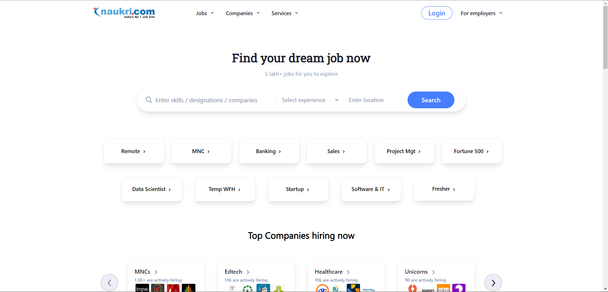
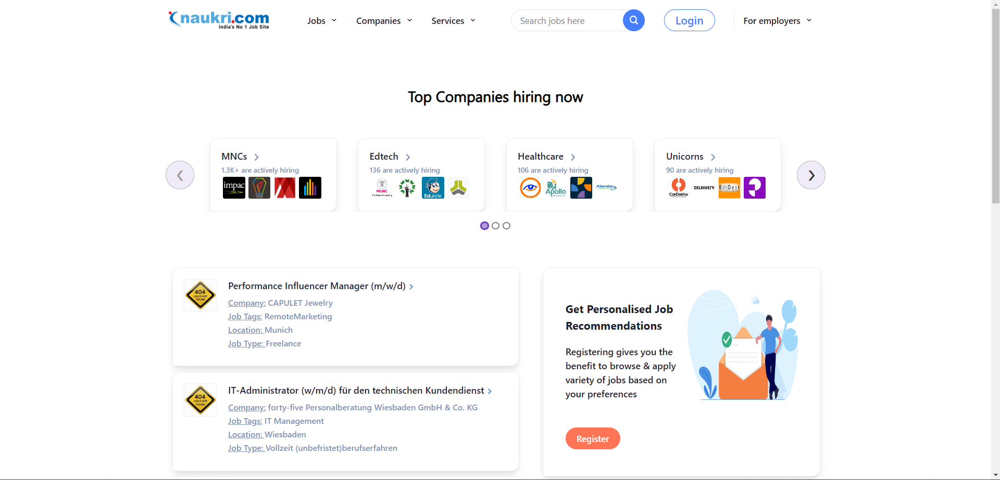
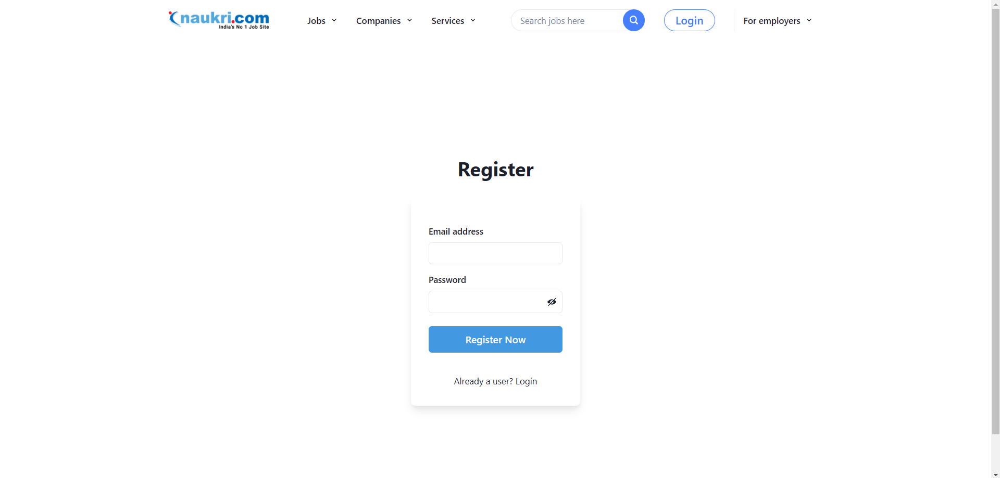
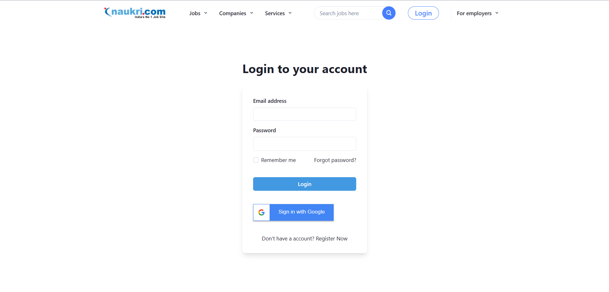
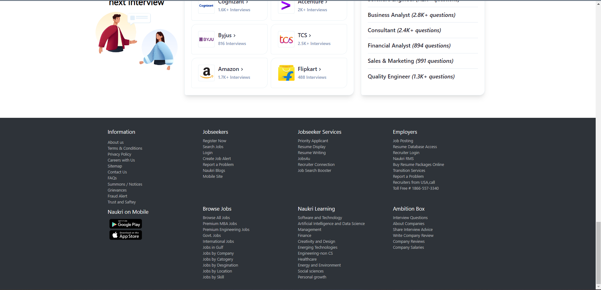

# Naukri.com -- Clone (Individual)
Naukri.com is an Indian employment website operting in India and Middle East. It was founded in March 1997 by Indian bussinessman Sanjeev Bikhchandani. Naukri.com is the largest employment website in India.
 
The Naukri.com website has been cloned by myself project of our construct week at **Masai School** over 5 days.
It is an individual project.

## Technology
- HTML, CSS, JavaScript,ReactJs, Redux, ChakraUi, axios, Firebase.
- **Version control:** Git and GitHub.
- **Hosting:** Netlify

## Features
- Multi-level interaction in the sign-up process for users to know their needs and to provide service accordingly
- Password strength given by the user is displayed live.
- Sign-in for users.
- Search for jobs

## Snapshots of the project

1. Landing page and navigation bar

*******************************************************************************

2. Naukri.com all jobs page

*******************************************************************************

4. Signup page

*******************************************************************************

5. SignIn Page

*******************************************************************************

7. Footer section

*******************************************************************************

 
<!-- ## Demo
>Link - [TravelGo](https://astonishing-yeot-482995.netlify.app/)
>Project demonstration link- 
<a href="#">click here</a> -->

## Run on your Machine
1. git clone https://github.com/sushantkr961/Naukri.com-Clone.git
2. npm install
3. npx json-server --watch db.json --port 3000
4. npm start
